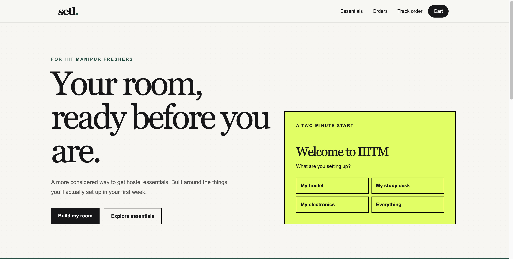
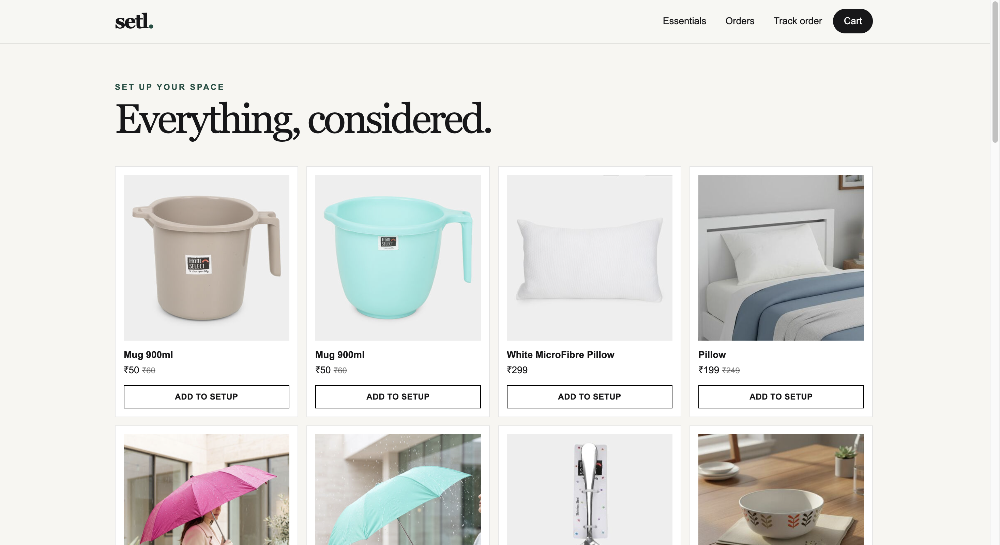
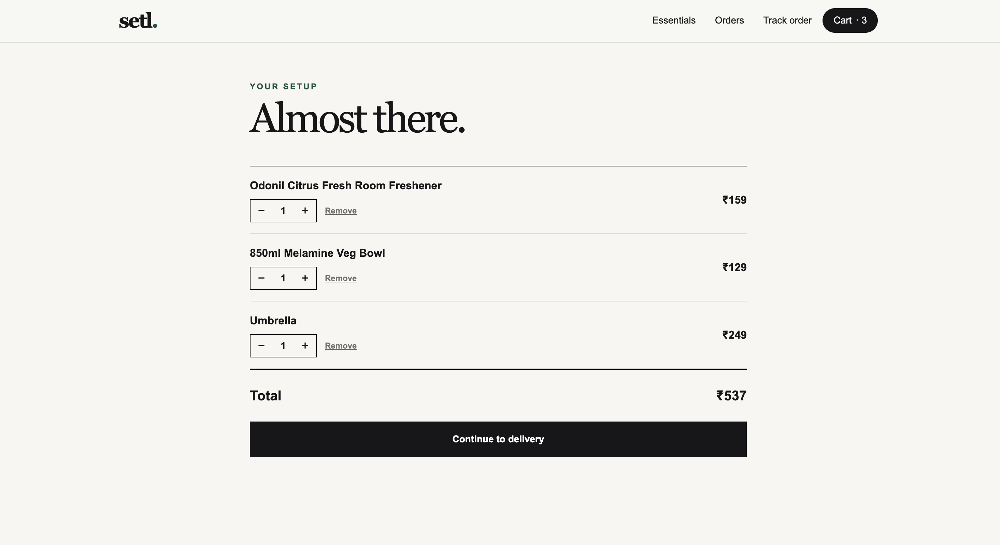
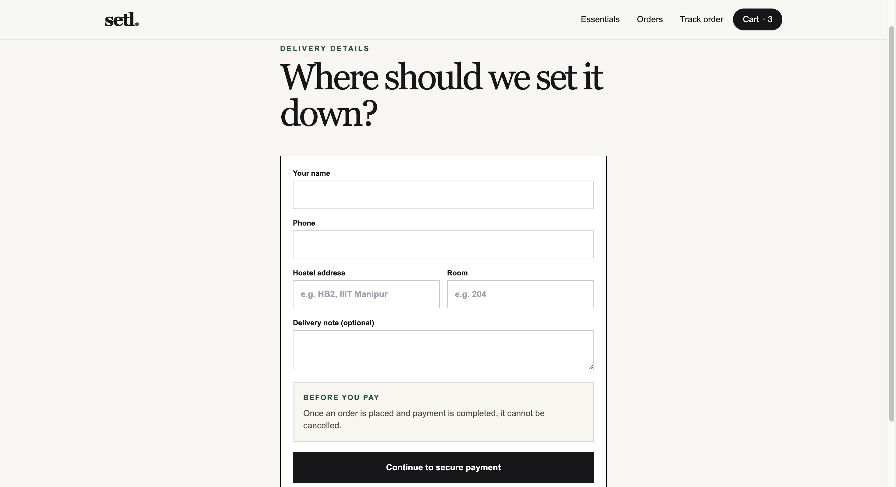
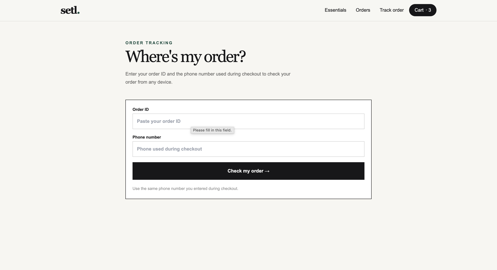
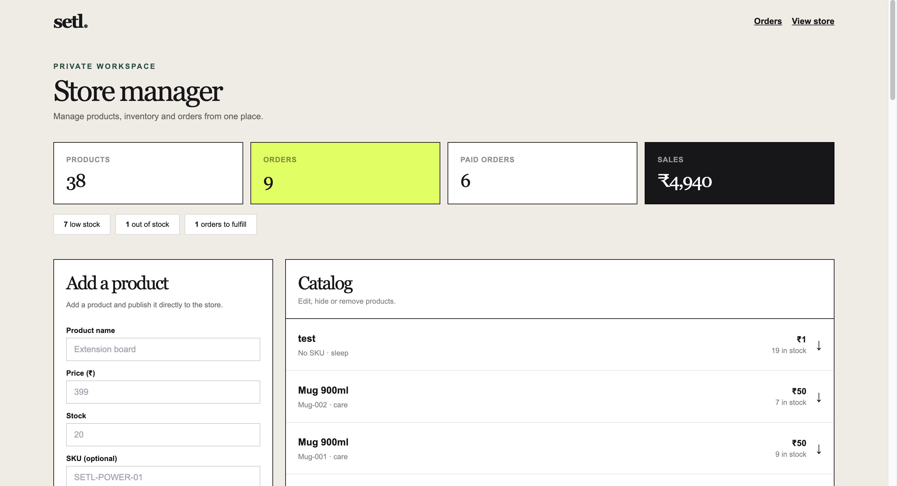

# SETL — Campus E-Commerce Platform

<p align="center">
  
  
  
  
  
  
  
  
</p>

<p align="center">
  <strong>A full-stack campus e-commerce platform built for real-world student commerce.</strong>
</p>

<p align="center">
  <a href="https://setl-delta.vercel.app">Live Website</a>
  •
  <a href="https://github.com/anjeet43/SETL">GitHub Repository</a>
</p>

---

## 📌 Overview

**SETL** is a full-stack campus e-commerce platform designed to make it easier for students to purchase hostel essentials and other daily-use products.

The platform was built as a real-world application rather than only as a frontend prototype. It handles the complete shopping and fulfillment workflow, including product browsing, cart management, checkout, online payments, order creation, inventory management, order tracking, administrative operations, and a dedicated architecture for live delivery tracking.

SETL is designed around a campus use case where students often need essential products quickly after arriving at their hostel.

### Complete workflow

```text
Product Discovery
        ↓
Product Selection
        ↓
Shopping Cart
        ↓
Checkout
        ↓
Online Payment
        ↓
Payment Verification
        ↓
Order Creation
        ↓
Inventory Management
        ↓
Order Fulfillment
        ↓
Delivery
        ↓
Order Tracking
        ↓
Live Delivery Tracking
        ↓
Order Delivered
```

---

# 🌐 Live Application

### Production Website

https://setl-delta.vercel.app

### GitHub Repository

https://github.com/anjeet43/SETL

---

# 🎯 Problem Statement

Students moving into a hostel often need multiple everyday products within a short period of time.

These may include:

- Room organization items
- Storage products
- Cleaning supplies
- Personal-use essentials
- Study-related accessories
- Daily-use products
- Hostel necessities

Traditional purchasing can require students to visit multiple stores, search for local availability, or wait for external e-commerce deliveries.

This creates several problems:

- Product discovery is inconvenient.
- Students may not know where products are available.
- Local stores may have limited availability.
- Immediate hostel delivery can be difficult.
- Local deliveries usually do not provide live tracking.
- There is no centralized campus-focused shopping experience.

---

# 💡 Solution

SETL provides a centralized online platform where students can:

- Browse available products.
- View product information and pricing.
- Add products to their shopping cart.
- Review their order.
- Enter delivery information.
- Make online payments.
- Receive an order reference.
- Track order fulfillment.
- View delivery progress.
- Access a separate live delivery tracking system.

On the backend, SETL handles:

- Product management
- Inventory
- Orders
- Order items
- Payment processing
- Payment verification
- Inventory reservation
- Fulfillment status
- Administrative operations
- Delivery assignments
- GPS locations
- Location history

---

# 🚀 Key Features

## 1. Product Catalog

SETL provides a product catalog where customers can browse products available for purchase.

A product can contain information such as:

- Product name
- Product description
- Selling price
- Compare-at price
- Category
- SKU
- Stock quantity
- Product image
- Product badge
- Product status
- Purchase price

The catalog is connected to the backend database so that product availability and pricing are managed centrally.

---

## 2. Product Categories

Products can be organized into categories to make browsing easier and to keep the storefront scalable as the catalog grows.

Example categories can include:

```text
Room Essentials
Cleaning
Storage
Study
Personal Care
Daily Use
Accessories
```

---

# 🛒 Shopping Cart

SETL includes a complete shopping cart workflow.

Customers can:

- Add products to the cart.
- Increase product quantity.
- Decrease product quantity.
- Remove products.
- Review item prices.
- Review quantities.
- Calculate the cart total.
- Continue shopping.
- Proceed to checkout.

Before an order is created, important cart and inventory information is validated again on the server.

This prevents the backend from blindly trusting values sent by the client.

---

# 💳 Online Payments

SETL integrates **Razorpay** for online payments.

The payment workflow is handled using server-side operations and payment verification.

### Payment architecture

```text
Customer
    ↓
Checkout Page
    ↓
Next.js Server
    ↓
Create Razorpay Order
    ↓
Razorpay Checkout
    ↓
Customer Completes Payment
    ↓
Razorpay Payment Response
    ↓
Server-Side Signature Verification
    ↓
Razorpay Webhook Processing
    ↓
Payment / Order State Updated
```

---

# 🔐 Payment Verification

Payment success is not trusted purely from the browser.

The backend verifies the Razorpay payment signature using the server-side secret.

The application also handles Razorpay webhooks so that payment events can be processed independently of the frontend.

This is important because client-side success callbacks alone are not sufficient to establish that a payment is valid.

---

# 📦 Order Management

After checkout and successful payment processing, SETL stores the order in PostgreSQL.

Order information can include:

- Customer name
- Customer phone
- Delivery information
- Hostel / room information where applicable
- Delivery notes
- Order total
- Payment status
- Fulfillment status
- Razorpay order ID
- Razorpay payment ID
- Order access token
- Creation timestamp

The order is then moved through the fulfillment workflow.

---

# 📊 Order Lifecycle

The normal order lifecycle is conceptually:

```text
Pending
   ↓
Confirmed
   ↓
Packing
   ↓
Ready
   ↓
Out for Delivery
   ↓
Delivered
```

Orders can also enter states such as:

```text
Cancelled
Refunded
```

The customer-facing tracking interface displays the current fulfillment state.

---

# 🔎 Order Tracking

SETL provides a customer-facing order status tracking system.

Customers can use their order reference to view the current state of an order.

Example order flow:

```text
Order Received
      ↓
Order Confirmed
      ↓
Preparing Your Order
      ↓
Ready for Delivery
      ↓
Out for Delivery
      ↓
Delivered
```

The normal order-status tracker remains separate from the live GPS tracking subsystem.

---

# 🗺️ Live Delivery Tracking

SETL also includes a separate delivery-tracking architecture designed to support a modern live delivery experience.

The live tracking page uses a separate route:

```text
/live-track/[id]
```

Example:

```text
/live-track/AFB27CF1
```

This system is intentionally separated from the existing order status tracker.

The purpose is to allow live location functionality to evolve without changing the standard order fulfillment tracker.

---

# 📍 Delivery Tracking Architecture

The live delivery system uses four main database entities:

```text
delivery_partners
delivery_assignments
delivery_locations
delivery_location_history
```

---

# 👤 Delivery Partners

The `delivery_partners` table represents delivery personnel.

It stores information such as:

```text
id
name
phone
is_active
created_at
```

A delivery partner can be assigned to an order through the delivery assignment system.

---

# 🚚 Delivery Assignments

The `delivery_assignments` table connects a specific order with a delivery partner.

Important information includes:

```text
id
order_id
delivery_partner_id
tracking_token
status
started_at
completed_at
created_at
```

The delivery status can represent states such as:

```text
assigned
started
paused
completed
cancelled
```

The architecture is designed so that an order can have a dedicated delivery session.

---

# 📡 Current Delivery Location

The `delivery_locations` table stores the latest GPS position for an active delivery.

Example fields:

```text
assignment_id
latitude
longitude
accuracy
speed
heading
updated_at
```

The table contains the most recent location for an assignment, making current-position queries fast.

---

# 🧭 Delivery Location History

The `delivery_location_history` table stores previous GPS coordinates.

Example fields:

```text
id
assignment_id
latitude
longitude
accuracy
speed
heading
recorded_at
```

This allows the application to preserve the delivery path rather than overwriting previous coordinates.

The history can later be used for:

- Route visualization
- Delivery analysis
- Route replay
- Delivery performance analytics
- Historical tracking

---

# ⚡ Supabase Realtime

Supabase Realtime is enabled for the delivery tracking subsystem.

The relevant tables include:

```text
delivery_assignments
delivery_locations
```

The intended architecture is:

```text
Delivery Partner Device
          ↓
Browser GPS API
          ↓
Delivery Backend
          ↓
delivery_locations
          ↓
Supabase Realtime
          ↓
Customer Browser
          ↓
Live Location Update
```

This provides the foundation for continuously updating the delivery marker on the customer's tracking page.

---

# 📍 GPS Tracking

The delivery architecture is designed to use browser geolocation capabilities.

A delivery device can provide:

```text
Latitude
Longitude
Accuracy
Speed
Heading
```

These coordinates can be:

1. Captured from the delivery partner device.
2. Sent to the backend.
3. Stored as the latest delivery location.
4. Stored in location history.
5. Broadcast through Supabase Realtime.
6. Displayed to the customer.

---

# 👨‍💼 Admin Dashboard

SETL includes a dedicated admin interface for managing store operations.

Administrative functionality includes:

- Product creation
- Product editing
- Product pricing
- Stock updates
- Product status management
- Product deletion / archival handling
- Order management
- Fulfillment status updates
- Store administration

---

# 🔐 Authentication & Authorization

SETL uses Supabase authentication and server-side authorization.

Administrative functionality is protected through authorization checks rather than simply hiding admin buttons in the UI.

Sensitive actions are performed on the server.

This protects operations such as:

- Creating products
- Updating products
- Updating stock
- Managing orders
- Updating order status
- Accessing privileged database operations

---

# 🛡️ Security

SETL follows a server-first architecture for sensitive operations.

Important security practices include:

- Server-side authorization
- Supabase Row Level Security
- Server-side payment verification
- Razorpay signature verification
- Payment webhooks
- Server-side inventory validation
- Database constraints
- Environment variables for secrets
- Separation of public and privileged Supabase clients

---

# 🔒 Service Role Security

The Supabase service-role key provides elevated database privileges.

Therefore:

```text
SUPABASE_SERVICE_ROLE_KEY
```

must only be used on the server.

It must never be sent to the browser or exposed in client-side JavaScript.

---

# 🔑 Order Tracking Security

The live tracking architecture contains tracking-token support so delivery location information can be secured separately from the normal order reference.

For production live tracking, access must be scoped so that one customer cannot simply guess another customer's order ID and access their delivery location.

Tracking tokens / sessions should therefore be validated on the server before exposing live delivery information.

---

# 🗄️ Database Architecture

SETL uses **PostgreSQL through Supabase**.

The database handles the core business state of the platform.

Major entities include:

```text
Users
Products
Categories
Orders
Order Items
Payments
Inventory
Delivery Partners
Delivery Assignments
Delivery Locations
Delivery Location History
```

---

# 🧠 Database-Level Business Logic

Critical business operations are implemented on the backend and database rather than relying only on client-side JavaScript.

This is particularly important for:

- Inventory reservation
- Stock validation
- Order creation
- Payment state
- Authorization
- Delivery data

Database constraints and transactional operations help maintain consistency.

---

# 📦 Inventory Management

Inventory is one of the most important backend systems in SETL.

Suppose:

```text
Stock = 1
```

Two customers attempt to purchase the final item simultaneously.

Without safe inventory handling:

```text
Customer A → sees stock = 1
Customer B → sees stock = 1

Both attempt purchase

Potential overselling
```

SETL uses server-side inventory validation and database-level reservation logic to reduce this risk.

---

# 🔄 Inventory Reservation Flow

Conceptually:

```text
Customer Checkout
        ↓
Validate Requested Quantity
        ↓
Check Database Stock
        ↓
Reserve Inventory
        ↓
Create Order
        ↓
Confirm Payment
        ↓
Commit Inventory Reservation
```

The important inventory logic is therefore not trusted to the frontend.

---

# 🧾 Order Items and Price Snapshots

Order items represent the products purchased in an order.

A historical order should preserve the price at which the customer purchased a product.

For example:

```text
Product price today = ₹100

Customer purchases product

Stored price snapshot = ₹100

Later:
Product price = ₹130
```

The historical order should still show ₹100 for the original purchase.

This is why order-item price snapshots are useful.

---

# 💰 Purchase Price and Profit

SETL's database architecture also supports purchase-price data.

Products can contain:

```text
purchase_price
```

Order items can store:

```text
purchase_price_snapshot
```

This enables future profit calculations.

### Basic calculation

```text
Gross Revenue
    -
Cost of Goods
    =
Gross Profit
```

For a product:

```text
Selling Price = ₹500
Purchase Price = ₹350
Quantity = 2
```

Then:

```text
Revenue = ₹500 × 2 = ₹1,000
Cost = ₹350 × 2 = ₹700

Gross Profit = ₹1,000 - ₹700 = ₹300
```

This architecture allows SETL to eventually support complete sales and profit analytics.

---

# 📊 Future Business Analytics

The purchase-price architecture can later support:

- Total revenue
- Total cost
- Gross profit
- Profit per product
- Profit per order
- Best-selling products
- Low-stock products
- Average order value
- Daily sales
- Weekly sales
- Monthly sales
- Product profitability

---

# 🖼️ Product Image Management

Product images are managed through Supabase Storage.

Product metadata remains in PostgreSQL while media files are stored separately.

This provides a clean separation between:

```text
Database
    +
Media Storage
```

---

# 🏗️ Application Architecture

SETL follows a full-stack architecture combining the frontend, server-side business logic, database, payment service, and realtime delivery infrastructure.

```text
┌────────────────────────────────────┐
│             CUSTOMER               │
│            Web Browser             │
└─────────────────┬──────────────────┘
                  │
                  ▼
┌────────────────────────────────────┐
│              NEXT.JS               │
│        React + TypeScript           │
│                                    │
│ Pages / Components / Server Logic  │
└───────────────┬────────────────────┘
                │
        ┌───────┴────────┐
        │                │
        ▼                ▼
┌───────────────┐  ┌─────────────────┐
│   Supabase    │  │    Razorpay     │
│               │  │                 │
│ PostgreSQL    │  │ Payments        │
│ Auth          │  │ Verification    │
│ Storage       │  │ Webhooks        │
│ Realtime      │  │                 │
└───────┬───────┘  └─────────────────┘
        │
        ▼
┌──────────────────────────┐
│   Delivery Tracking      │
│                          │
│ Assignments              │
│ GPS Locations            │
│ Location History         │
└──────────────────────────┘
```

---

# 🧰 Technology Stack

## Frontend

### Next.js

Next.js is used as the main application framework.

It provides:

- App Router
- Server Components
- Client Components
- Server Actions
- Route Handlers
- Server-side rendering
- Backend integration

---

### React

React is used for interactive user interfaces such as:

- Product cards
- Cart
- Checkout
- Admin interface
- Tracking interface
- Interactive controls

---

### TypeScript

TypeScript is used across the application to provide static typing and improve code reliability.

Benefits include:

- Type safety
- Better editor support
- Safer refactoring
- Easier maintenance
- Fewer runtime mistakes

---

### Tailwind CSS

Tailwind CSS is used for:

- Responsive layouts
- Component styling
- Spacing
- Typography
- Colors
- Interactive states
- Mobile responsiveness

---

# Backend

## Supabase

Supabase provides:

- PostgreSQL
- Authentication
- Storage
- Realtime
- Row Level Security

---

## PostgreSQL

PostgreSQL is responsible for the relational data model and transactional business operations.

It stores:

- Users
- Products
- Orders
- Order items
- Inventory
- Payment-related information
- Delivery assignments
- GPS data
- Historical location data

---

## Razorpay

Razorpay is used for online payment processing.

SETL integrates:

- Razorpay orders
- Checkout
- Payment verification
- HMAC signature validation
- Webhooks

---

## Vercel

Vercel is used to deploy the production Next.js application.

Deployment flow:

```text
GitHub
   ↓
Vercel
   ↓
Next.js Production Build
   ↓
Production Application
```

---

# 📁 Project Structure

A simplified structure of the project:

```text
SETL/
│
├── app/
│   ├── admin/
│   │   └── ...
│   │
│   ├── checkout/
│   │   └── ...
│   │
│   ├── live-track/
│   │   └── [id]/
│   │       └── page.tsx
│   │
│   ├── orders/
│   │   └── [id]/
│   │       └── ...
│   │
│   ├── track-order/
│   │   └── ...
│   │
│   ├── api/
│   │   └── ...
│   │
│   ├── page.tsx
│   └── ...
│
├── components/
│   └── ...
│
├── lib/
│   ├── supabase/
│   │   └── ...
│   └── ...
│
├── public/
│   └── ...
│
├── package.json
├── tsconfig.json
├── next.config.*
├── tailwind.config.*
└── README.md
```

---

# 🔄 Customer Journey

A typical customer journey looks like:

```text
1. Open SETL
        ↓
2. Browse products
        ↓
3. Select products
        ↓
4. Add products to cart
        ↓
5. Review cart
        ↓
6. Enter delivery information
        ↓
7. Checkout
        ↓
8. Razorpay payment
        ↓
9. Payment verification
        ↓
10. Order creation
        ↓
11. Order tracking
        ↓
12. Order preparation
        ↓
13. Delivery assignment
        ↓
14. Out for delivery
        ↓
15. Live tracking
        ↓
16. Delivered
```

---

# 💳 Detailed Payment Flow

```text
                  CUSTOMER
                     │
                     ▼
                 CHECKOUT
                     │
                     ▼
              NEXT.JS SERVER
                     │
                     ▼
             VALIDATE REQUEST
                     │
                     ▼
             CHECK INVENTORY
                     │
                     ▼
          CREATE RAZORPAY ORDER
                     │
                     ▼
             RAZORPAY CHECKOUT
                     │
                     ▼
           CUSTOMER MAKES PAYMENT
                     │
                     ▼
          RAZORPAY RESPONSE DATA
                     │
                     ▼
         SERVER-SIDE VERIFICATION
                     │
                     ▼
           RAZORPAY WEBHOOK
                     │
                     ▼
             UPDATE ORDER STATE
```

---

# 📦 Detailed Inventory Flow

```text
Customer
   ↓
Cart
   ↓
Checkout
   ↓
Server Validation
   ↓
Database Stock Check
   ↓
Inventory Reservation
   ↓
Order Creation
   ↓
Payment Verification
   ↓
Inventory Commitment
```

---

# 🚚 Delivery Flow

```text
Order Confirmed
       ↓
Order Prepared
       ↓
Order Ready
       ↓
Delivery Partner Assigned
       ↓
Delivery Started
       ↓
GPS Location Updates
       ↓
Realtime Location Updates
       ↓
Customer Tracking
       ↓
Delivery Completed
```

---

# 📡 Live Tracking Flow

```text
Delivery Partner Device
          │
          ▼
     Browser GPS
          │
          ▼
  Latitude / Longitude
          │
          ▼
    Delivery Backend
          │
          ▼
 delivery_locations
          │
          ├───────────────► delivery_location_history
          │
          ▼
    Supabase Realtime
          │
          ▼
 Customer Live Track Page
          │
          ▼
      Moving Marker
```

---

# 🧪 Development and Testing

Development and testing included test records for:

- Orders
- Delivery partners
- Delivery assignments
- GPS coordinates
- Live location retrieval
- Supabase Realtime
- Payment workflows
- Inventory logic

Test records should be removed from production environments before real deployment where applicable.

Production databases should never depend on test users, test delivery partners, fake GPS coordinates, or test payment data.

---

# ⚙️ Local Development Setup

## Prerequisites

Install the following:

- Node.js
- npm / pnpm / yarn
- Git

You will also need accounts/configuration for:

- Supabase
- Razorpay

---

## 1. Clone the Repository

```bash
git clone https://github.com/anjeet43/SETL.git
cd SETL
```

---

## 2. Install Dependencies

Using npm:

```bash
npm install
```

Or pnpm:

```bash
pnpm install
```

Or yarn:

```bash
yarn install
```

---

# 🔐 3. Configure Environment Variables

Create:

```text
.env.local
```

Example:

```env
NEXT_PUBLIC_SUPABASE_URL=your_supabase_url
NEXT_PUBLIC_SUPABASE_ANON_KEY=your_supabase_anon_key

SUPABASE_SERVICE_ROLE_KEY=your_service_role_key

RAZORPAY_KEY_ID=your_razorpay_key_id
RAZORPAY_KEY_SECRET=your_razorpay_key_secret
```

Replace the values with your own credentials.

Never commit `.env.local` to GitHub.

---

# 🗄️ 4. Configure Supabase

Create a Supabase project and configure:

- PostgreSQL database
- Authentication
- Storage
- Row Level Security
- Realtime

The required tables and database functions must also be created according to the application schema.

---

# 💻 5. Run Locally

Start the development server:

```bash
npm run dev
```

Then open:

```text
http://localhost:3000
```

---

# 🏭 Production Build

Create a production build:

```bash
npm run build
```

Run the production application locally:

```bash
npm start
```

---

# ☁️ Deployment

SETL is deployed on Vercel.

Typical deployment workflow:

```text
Local Development
       ↓
Git Commit
       ↓
Git Push
       ↓
GitHub
       ↓
Vercel
       ↓
Production Build
       ↓
Production Website
```

Production environment variables must be configured in the Vercel dashboard.

---

# 🌍 Production Infrastructure

```text
                         ┌──────────────┐
                         │   Customer   │
                         │   Browser    │
                         └──────┬───────┘
                                │
                                ▼
                      ┌──────────────────┐
                      │      Vercel      │
                      │      Next.js     │
                      └────────┬─────────┘
                               │
                 ┌─────────────┴─────────────┐
                 │                           │
                 ▼                           ▼
        ┌─────────────────┐         ┌─────────────────┐
        │    Supabase     │         │    Razorpay     │
        │                 │         │                 │
        │ PostgreSQL      │         │ Payment         │
        │ Authentication  │         │ Verification    │
        │ Storage         │         │ Webhooks        │
        │ Realtime        │         │                 │
        └────────┬────────┘         └─────────────────┘
                 │
                 ▼
        ┌──────────────────────┐
        │ Delivery Tracking    │
        │                      │
        │ Assignments          │
        │ GPS Locations        │
        │ Location History     │
        └──────────────────────┘
```

---

# 🔒 Security Notes

## Never commit secrets

Do not commit files containing:

```text
.env
.env.local
.env.production
API keys
Supabase service-role keys
Razorpay secret keys
Database passwords
Authentication secrets
Private tokens
```

---

## Server-side Secrets

Secrets should only be accessible by trusted server-side code.

The following must never be exposed to the browser:

```text
SUPABASE_SERVICE_ROLE_KEY
RAZORPAY_KEY_SECRET
Database credentials
Private API credentials
```

---

# 🧠 Engineering Principles

SETL follows several practical software engineering principles:

### 1. Server-side validation

Critical values are validated on the backend.

### 2. Database-level correctness

Inventory and relational constraints are handled at the database layer wherever appropriate.

### 3. Payment verification

Payment success is not trusted solely from frontend callbacks.

### 4. Secure authorization

Admin functionality is protected using server-side authorization.

### 5. Separation of responsibilities

Storefront, order management, payments, inventory, and delivery tracking are treated as separate logical systems.

### 6. Realtime architecture

Delivery tracking is designed as a realtime subsystem rather than mixing GPS functionality into the normal order-status tracker.

---

# 🧩 Order Tracking vs Live Tracking

SETL intentionally has two separate tracking concepts.

## Standard Order Tracking

Handles:

```text
Order Received
Confirmed
Packing
Ready
Out for Delivery
Delivered
```

This answers:

> "What is the current status of my order?"

---

## Live Delivery Tracking

Handles:

```text
Delivery Partner
Assignment
GPS Coordinates
Current Location
Location History
Realtime Updates
```

This answers:

> "Where is my delivery right now?"

The two systems are separate so that changes to GPS tracking do not interfere with the core order tracking system.

---

# 📈 Scalability

SETL uses technologies capable of supporting a larger deployment.

## PostgreSQL

Handles relational data such as:

- Orders
- Products
- Inventory
- Users
- Deliveries
- Historical locations

## Next.js + Vercel

Provides a scalable web application deployment model.

## Supabase Realtime

Provides the infrastructure required for realtime delivery updates.

## Supabase Storage

Provides scalable product image storage.

---

# 📱 Responsive Design

SETL is designed for both desktop and mobile users.

Mobile usability is especially important because a large percentage of customers in a campus environment may access the platform using a smartphone.

The UI uses responsive layouts and mobile-friendly controls.

---

# 🎨 Design Philosophy

SETL uses a minimal visual design focused on:

- Clear navigation
- Strong typography
- Simple layouts
- High contrast
- Fast shopping flow
- Responsive UI
- Clear order information
- Minimal unnecessary UI

The goal is to make purchasing quick and straightforward.

---

# 🧪 Testing Areas

Important areas for testing include:

## Products

- Product creation
- Product editing
- Price updates
- Stock updates
- Product status
- Invalid product data

## Cart

- Add item
- Remove item
- Change quantity
- Empty cart
- Out-of-stock product

## Checkout

- Valid checkout
- Invalid checkout
- Missing delivery details
- Insufficient stock

## Payments

- Successful payment
- Failed payment
- Invalid signature
- Duplicate payment events
- Webhook processing

## Orders

- Order creation
- Status updates
- Order lookup
- Invalid order reference

## Delivery

- Partner assignment
- Delivery assignment
- GPS updates
- Location history
- Realtime updates
- Completion state

---

# 🧑‍💻 Development Workflow

A typical development workflow for SETL is:

```text
Feature Requirement
        ↓
Frontend Development
        ↓
Backend Development
        ↓
Database Changes
        ↓
Validation
        ↓
Local Testing
        ↓
Git Commit
        ↓
GitHub
        ↓
Vercel Deployment
        ↓
Production Testing
```

---

# 🌟 Real-World Usage

SETL was built and deployed for actual campus use rather than only as a demonstration project.

The application has been used to:

- Accept real customer orders.
- Sell actual products.
- Process real online payments.
- Manage inventory.
- Fulfill orders.
- Generate real sales.
- Generate profit from actual transactions.

This means the project covers not only software development but also the practical workflow involved in operating a small e-commerce platform.

---

# 🏆 What This Project Demonstrates

SETL demonstrates practical experience in:

## Frontend Development

- Next.js
- React
- TypeScript
- Tailwind CSS
- Responsive UI

## Backend Development

- Server Actions
- Route Handlers
- API design
- Business logic
- Server-side validation

## Databases

- PostgreSQL
- Supabase
- Relational database design
- Database constraints
- Database functions
- Transactions
- Row Level Security

## Payments

- Razorpay
- Payment order creation
- Payment verification
- HMAC signature validation
- Webhooks

## Authentication

- Supabase Auth
- Role-based authorization
- Protected server operations

## Inventory

- Stock validation
- Inventory reservation
- Transaction-safe operations
- Overselling prevention

## Realtime Systems

- Supabase Realtime
- Delivery assignments
- GPS location storage
- Location history

## Deployment

- GitHub
- Vercel
- Production environment configuration
- Production debugging

---

# 🚧 Current Limitations

The live-delivery subsystem is currently an evolving part of the project.

The architecture currently establishes:

- Delivery partners
- Delivery assignments
- Tracking tokens
- Current GPS location storage
- Location history
- Supabase Realtime

Further production improvements include:

- Interactive map provider
- Live moving marker
- Road route visualization
- Accurate road-based ETA
- Continuous browser GPS updates
- Delivery partner interface
- Secure tracking sessions
- Production-grade location permissions

---

# 🔮 Future Roadmap

## Phase 1 — Core E-Commerce

- [x] Product catalog
- [x] Product categories
- [x] Shopping cart
- [x] Checkout
- [x] Razorpay payments
- [x] Payment verification
- [x] Order creation
- [x] Order tracking

## Phase 2 — Administration

- [x] Admin authentication
- [x] Product management
- [x] Product editing
- [x] Stock management
- [x] Order management
- [x] Fulfillment management

## Phase 3 — Inventory

- [x] Stock validation
- [x] Inventory reservation
- [x] Transaction-safe inventory operations
- [x] Purchase-price support
- [ ] Advanced inventory analytics

## Phase 4 — Live Delivery

- [x] Delivery partner model
- [x] Delivery assignment model
- [x] GPS location storage
- [x] Location history
- [x] Supabase Realtime setup
- [ ] Delivery partner interface
- [ ] Continuous GPS updates
- [ ] Interactive live map
- [ ] Moving delivery marker
- [ ] Route visualization
- [ ] Road-based ETA
- [ ] Production tracking authentication

## Phase 5 — Business Analytics

- [ ] Revenue dashboard
- [ ] Gross profit dashboard
- [ ] Product profitability
- [ ] Sales trends
- [ ] Inventory analytics
- [ ] Low-stock alerts
- [ ] Order analytics
- [ ] Business reporting

---

# 📊 Planned Analytics

Future analytics can include:

```text
Total Orders
Total Revenue
Total Cost
Gross Profit
Average Order Value
Best-Selling Products
Low-Stock Products
Daily Revenue
Weekly Revenue
Monthly Revenue
Profit Per Product
Profit Per Order
Sales By Category
```

---

# 🗺️ Future Live Map

The delivery tracking system can eventually evolve into a complete live map experience containing:

```text
Customer Location
       │
       │
       ▼
Delivery Route
       │
       ▼
Delivery Partner
       │
       ▼
Live GPS Position
       │
       ▼
Estimated Arrival
```

A future production implementation can use a map provider and routing API to calculate:

- Road distance
- Travel time
- ETA
- Route geometry
- Dynamic marker position

---

# 📸 Screenshots

Add application screenshots to a `screenshots` directory and reference them here.

Recommended screenshots:

```text
screenshots/
├── storefront.png
├── product-page.png
├── cart.png
├── checkout.png
├── order-tracking.png
├── admin-dashboard.png
└── live-tracking.png
```

Example:

### Storefront

```md

```

### Product Page

```md

```

### Cart

```md

```

### Checkout

```md

```

### Order Tracking

```md

```

### Admin Dashboard

```md

```

### Live Tracking

```md

```

---

# 🤝 Contributing

SETL is primarily a personal project.

For development contributions, the standard Git workflow can be used.

Create a branch:

```bash
git checkout -b feature/my-feature
```

Add changes:

```bash
git add .
```

Commit:

```bash
git commit -m "Add my feature"
```

Push:

```bash
git push origin feature/my-feature
```

Then open a Pull Request.

---

# ⚠️ Important Developer Notes

Running SETL locally may require external service configuration.

You may need:

- Supabase project
- PostgreSQL database
- Supabase Auth
- Supabase Storage
- Supabase Realtime
- Razorpay account
- Razorpay credentials

Some production-specific functionality may require additional setup.

Do not use production credentials for local experimentation.

---

# 📝 License

This project currently does not specify an open-source license.

If SETL is later released as open-source software, an appropriate license such as MIT can be added after deciding the permissions to grant users.

---

# 👨‍💻 Author

## Anjeet Kumar

Full-Stack Developer

### GitHub

https://github.com/anjeet43

### SETL Repository

https://github.com/anjeet43/SETL

### Live Website

https://setl-delta.vercel.app

---

# ⭐ Project Summary

**SETL** is a full-stack campus e-commerce platform built using:

```text
Next.js
React
TypeScript
Tailwind CSS
Supabase
PostgreSQL
Razorpay
Vercel
Supabase Realtime
```

The platform provides:

```text
🛍️ Product Store
🛒 Shopping Cart
💳 Online Payments
📦 Order Management
📊 Inventory Management
🔐 Authentication
👨‍💼 Admin Dashboard
🔎 Order Tracking
🚚 Delivery Management
📍 GPS Location Infrastructure
📡 Realtime Delivery Architecture
💰 Purchase Price & Profit Architecture
```

The platform has been deployed and used in a real campus environment for actual product sales and customer orders.

---

# 🚀 SETL

> **A campus-focused e-commerce platform built to connect students, products, payments, inventory, and delivery in one system.**

<p align="center">
  Built with Next.js • TypeScript • Supabase • PostgreSQL • Razorpay • Vercel
<<<<<<< HEAD
</p>
=======
</p>
>>>>>>> d0df6db (Update README and add screenshots)
